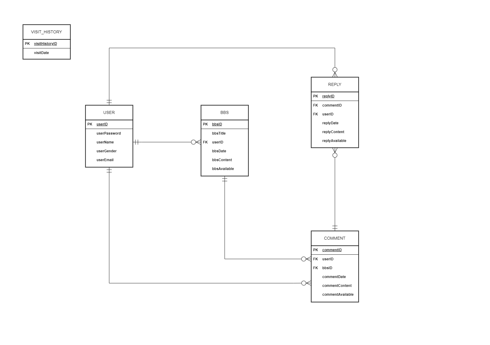

# JSP 게시판 웹 사이트
유튜버 나동빈님의 [JSP게시판 만들기 강좌](https://www.youtube.com/playlist?list=PLRx0vPvlEmdAZv_okJzox5wj2gG_fNh_6)를 클론 코딩해서 만든 게시판 프로젝트입니다. 현재 이 게시판에 추가해보고 싶은 사항들을 기획하고 적용해보고 있습니다. 현재 CAFE24 호스팅 서버에 배포된 상태이며 아래 링크를 누르면 웹 사이트에 방문하실 수 있습니다.

<https://devchh006.cafe24.com/BBS>
#

# 기간
2024/01/01 ~ 2024/01/08 : JSP 웹 게시판 제작

2024/01/27 ~ 2024/02/05 :  통신 방식을 HTTP -> HTTPS로 변경([HTTPS 통신 구현 과정](https://itknowledgewarehouse.tistory.com/213))

2024/02/10 ~ 2024/03/23 : 방문자 수 확인 및 댓글&답글 관리 기능 추가, 프로젝트 ERD 설계 ([프로젝트의 ERD 설계 및 방문자 수 확인, 댓글&답글 관리 기능 구현 과정](https://itknowledgewarehouse.tistory.com/210))
#

# 프로젝트 소개
(이미지 추가 예정)
#

# 사용한 기술 스택
+ OS : Windows10 64bit
+ Langauge : JAVA SE 8(JDK 8u151), JSP
+ Web Server : Apache Tomcat 8.5.35
+ DBMS : MySQL 5.7.18
+ Framework : Bootstrap 3.3.7
+ Protocol : HTTP(S)
+ S/W Architectural pattern : MVC(Model-View-Controller)
#

# 프로젝트의 ERD 구조

#

